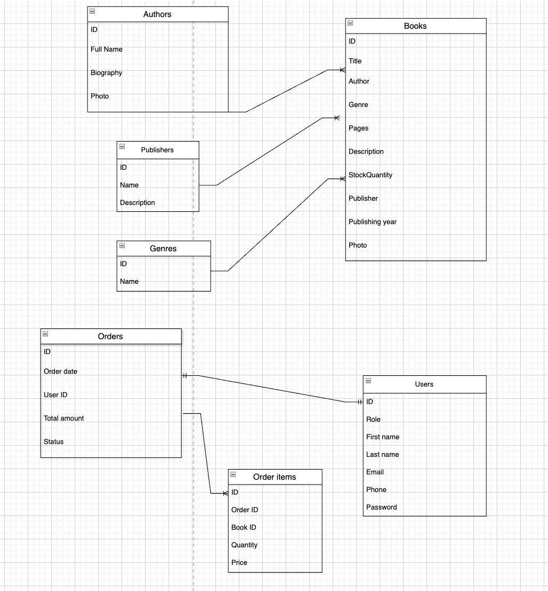

# Bookstore Website


## General description

* *The main purpose* of this site is to offer a convenient and multifunctional way of purchasing books, with ability to search book by title, author, as well as to filter books by publishers and genre and sort the results from the cheapest to the most expensive, by popularity, by genre. There is a separate page for each book, where there will be more detailed information about book and its author.

* There is also an option to *search for an author* and see all their books available


* It is possible to add data (books, authors, publishers),as well as edit it or delete completely *for those who have authority to do this actions*.

* *For regular clients* there is an opportunity to register and log in to their profile where they can view the history of their book orders or edit data about themselves. Surely, they also can create a new order and add new items to their cart.

* Finally, there is *“About Us”* page with contact information, shipping, and return information.

# BookStore API

## Опис застосунку
Сайт для онлайн-книгарні, який надає зручний та багатофункціональний спосіб покупки книг. Користувачі можуть шукати книги за назвою, автором, фільтрувати за видавництвами та жанрами, сортувати результати за ціною, популярністю, жанром. Для кожної книги є окрема сторінка з детальною інформацією про книгу та автора.

## REST API + endpoints description

### Books

#### GET /api/books
- **Action**: Get the book list with ability to sort or filter
- **Method**: GET
- **Parameneters**:
    - `search` (query) - search by name or author
    - `genre` (query) - filter by genre
    - 'publisher' (query) - filter by publisher
    - `sort` (query) - sort (price_asc, price_desc, popularity)
    - `page` (query) - page number
    - `limit` (query) - number of elements on page
- **Response Status**: 200
- **Response Body**:
```json
{
  "books": [
    {
      "id": 1,
      "title": "book name",
      "author": "author",
      "price": book price,
      "genre": "genre",
      "publisher": "publisher",
      "image_url": "url_of_image"
    }
  ],
  "totalPages": 2,
  "currentPage": 1
}
```

#### GET /books/{id}
- **Action**: Get detailed information about a specific book
- **Method**: GET
- **Response Status**: 200
- **Response Body**:
```json
{
  "id": 1,
  "title": "book name",
  "author": "author",
  "description": "description",
  "price": book price,
  "genre": "genre",
  "publisher": "publisher",
  "publication_year": year,
  "pages": pages,
  "language": "language",
  "in_stock": true/false,
  "image_url": "url_of_image"
}
```

### Authors

#### GET /authors
- **Action**: Authors search
- **Method**: GET
- **Параметри запиту**:
    - `search` (query) - search by author name
- **Response Status**: 200
- **Response Body**:
```json
{
  "authors": [
    {
      "id": 1,
      "name": "author name",
      "bio": "short bio",
      "image_url": "url_of_image"
    }
  ]
}
```

#### GET /authors/{id}/books
- **Action**: Get all books by a cpecific author
- **Method**: GET
- **Response Status**: 200
- **Response Body**:
```json
{
  "author": {
    "id": 1,
    "name": "author name"
  },
  "books": [
    {
      "id": 1,
      "title": "book name",
      "price": book price,
      "genre": "genre"
    }
  ]
}
```

### Authentification and users

#### POST /auth/register
- **Action**: Registering a new user
- **Method**: POST
- **Request Body**:
```json
{
  "email": "user@example.com",
  "password": "password123",
  "first_name": "first name",
  "last_name": "last name",
  "phone": "+380123456789"
}
```
- **Response Status**: 201
- **Response Body**:
```json
{
  "message": "Registered successfully!",
  "user_id": 1
}
```

#### POST /auth/login
- **Action**: Log in to the account
- **Method**: POST
- **Request Body**:
```json
{
  "email": "user@example.com",
  "password": "password123"
}
```
- **Response Status**: 200
- **Response Body**:
```json
{
  "token": "jwt_token",
  "user": {
    "id": 1,
    "email": "user@example.com",
    "first_name": "first name",
    "last_name": "last name"
  }
}
```

### Cart and orders

#### GET /cart
- **Action**: Get the cart information (authontefication is required)
- **Method**: GET
- **Headers**: Authorization: Bearer {token}
- **Response Status**: 200
- **Response Body**:
```json
{
  "items": [
    {
      "book_id": 1,
      "title": "book name",
      "quantity": quantity,
      "price": price of book,
      "total": total price
    }
  ],
  "total_amount": total purchase price
}
```

#### POST /cart/items
- **Action**: Add new item to cart (authontefication is required)
- **Method**: POST
- **Headers**: Authorization: Bearer {token}
- **Request Body**:
```json
{
  "book_id": 1,
  "quantity": quantity
}
```
- **Response Status**: 201
- **Response Body**:
```json
{
  "message": "Successfully added to cart!"
}
```


#### GET /api/orders/history
- **Action**: Get purchase history (authontefication is required)
- **Method**: GET
- **Headers**: `Authorization: Bearer {token}`
- **Response Status**: 200
- **Response Body**:
```json
{
  "orders": [
    {
      "id": 1,
      "order_date": "order date",
      "total_amount": total of order,
      "status": "delivered/on its way/cancelled",
      "items_count": items count
    }
  ]
}
```

### Administration (admin permission is required)

#### POST /admin/book
- **Action**: Add a new book
- **Method**: POST
- **Headers**: `Authorization: Bearer {admin_token}`
- **Request Body**:
```json
{
  "title": "book name",
  "author_id": 1,
  "description": "book description",
  "price": book price,
  "genre": "genre",
  "publisher_id": 1,
  "publication_year": year,
  "pages": pages,
  "language": "language",
  "in_stock": true/false
}
```
- **Response Status**: 201
- **Response Body**:
```json
{
  "message": "Book was successuly added!",
  "book_id": 2
}
```

#### PUT /admin/book/{id}
- **Action**: Edit information about a book
- **Method**: PUT
- **Headers**: `Authorization: Bearer {admin_token}`
- **Request Body**: (the same as POST /admin/books)
- **Response Status**: 200
- **Response Body**:
```json
{
  "message": "Information is updated!"
}
```

#### DELETE /admin/books/{id}
- **Action**: Delete a book
- **Method**: DELETE
- **Headers**: `Authorization: Bearer {admin_token}`
- **Response Status**: 200
- **Response Body**:
```json
{
  "message": "Book is deleted!"
}
```

### Info pages

#### GET /info/about
- **Action**: Get info about bookstore ("About Us")
- **Method**: GET
- **Response Status**: 200
- **Response Body**:
```json
{
  "title": "About us",
  "description": "General info",
  "contact_info": {
    "address": "adsress",
    "phone": "+380123456789",
    "email": "bookstore@example.com"
  },
  "shipping_info": "Delivery info",
  "return_policy": "Return policy"
}
```

